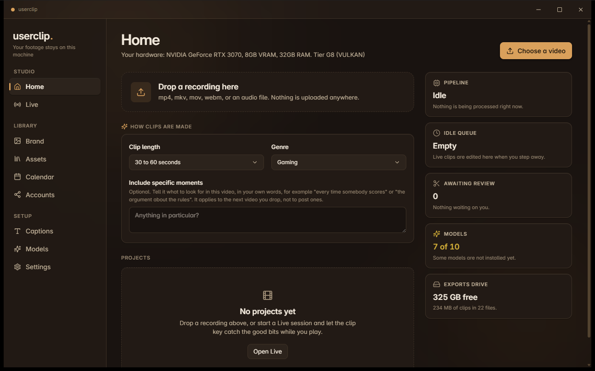
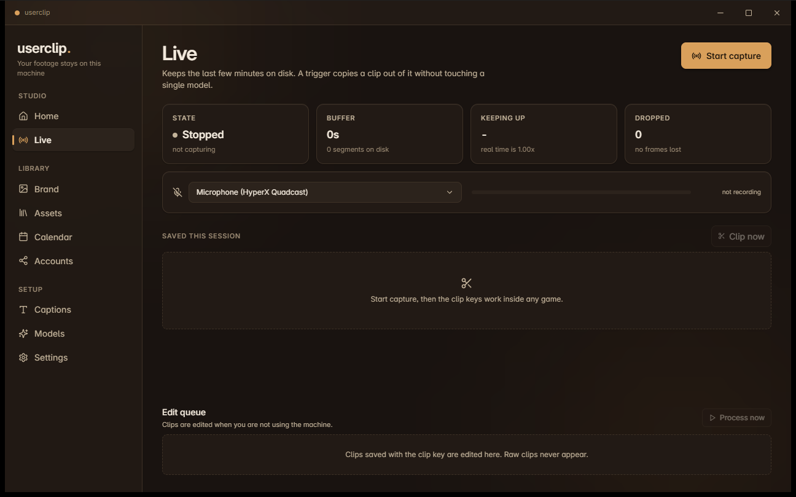
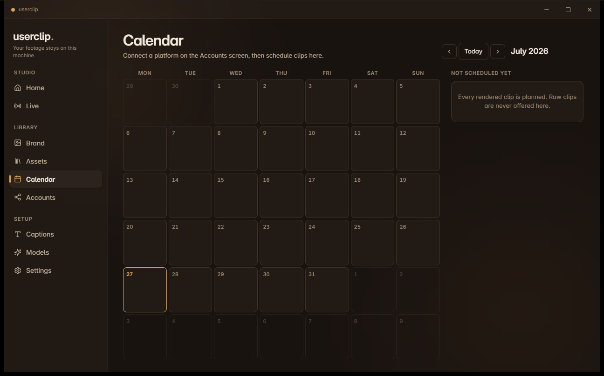
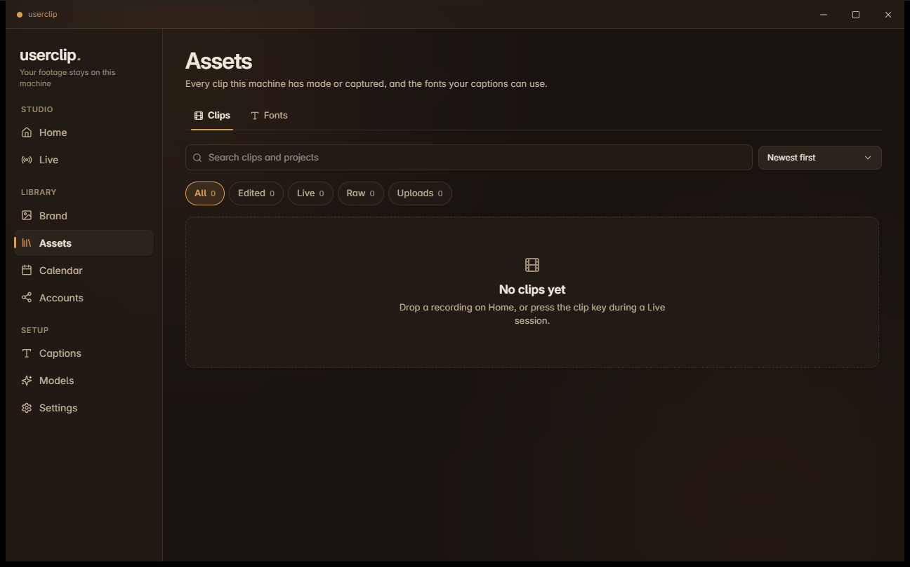
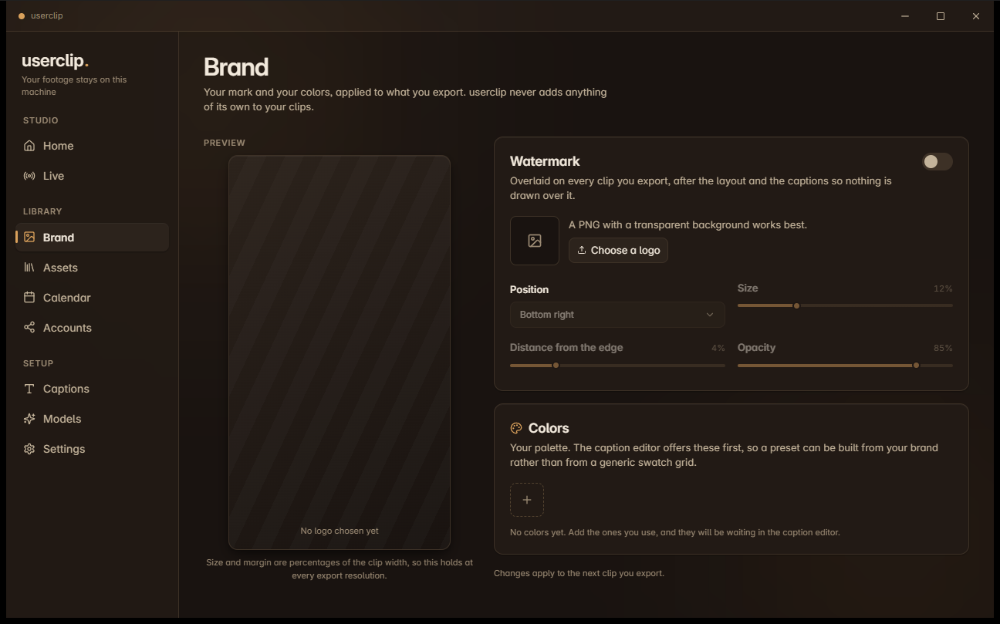
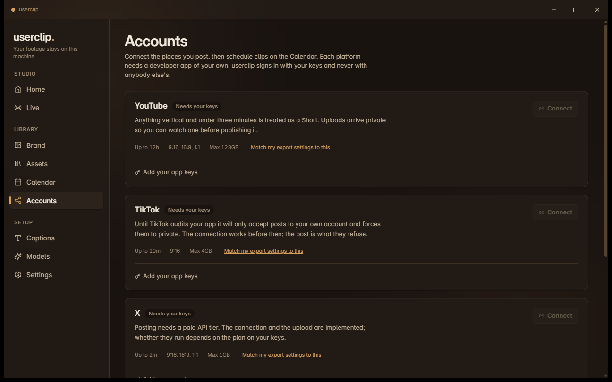

# userclip

**Three hours in. Eleven clips out. Nothing uploaded.**

Turn long recordings into short vertical clips, entirely on your own machine.
No account, no credits, no watermark, no upload.

[**Download**](https://github.com/iamjrmh/userclip/releases) &nbsp;·&nbsp;
[Website](https://userclip.lol) &nbsp;·&nbsp;
[Privacy](https://userclip.lol/privacy) &nbsp;·&nbsp;
[Terms](https://userclip.lol/terms)

 

 

## What it does

Drop in a recording. userclip transcribes it with word level timing, has a
language model pick the moments that stand on their own, frames each one for
vertical, writes the captions, and renders.

Every model runs on your hardware. Nothing is queued behind anybody else,
nothing is metered, and your footage never leaves the machine.

 

## Clip while you play

A rolling replay buffer sits on disk during a session. Press the clip key and
userclip copies bytes straight out of it: no re-encode, no transcription, no
model, nothing that could stall a frame. The hotkey is a raw input hook, so it
fires inside exclusive fullscreen games.

There is a **second key that saves a clip no model will ever touch**, not later,
not while you are away, not ever. The database itself refuses to process one, so
it is a guarantee rather than a setting you have to trust.

 

## It works while you are not

<table>
<tr>
<td width="50%" valign="top">

</td>
<td width="50%" valign="top">

</td>
</tr>
<tr>
<td valign="top">

**Edits when you step away.** Clips saved during a session are processed only
once you are idle. userclip watches keyboard and mouse, GPU load, free graphics
memory, whether anything is fullscreen, and whether you are on battery. The
moment you come back it stops, mid job, and resumes at the stage it lost.

</td>
<td valign="top">

**Everything in one place.** Every clip this machine has made or captured, with
search, filters, and a preview. Raw clips appear here too, marked, and can never
be processed unless you send one to the editor yourself.

</td>
</tr>
</table>

 

## Your brand, not ours

Put your own logo on your exports, sized and positioned as a percentage of the
clip so it holds at every resolution. Keep your palette here and the caption
editor offers it first.

userclip adds nothing of its own to your clips. No watermark, no credit, no
metadata identifying the tool.

 

## Post on a schedule

Connect the platforms you use, plan clips onto the calendar, and userclip
uploads them at the time you chose. Uploads never run while you are recording.

Each platform shows what it will actually accept, and what it will not, so a
clip is never rejected after a long upload for a reason you could have seen
first.

 

## What it needs

Windows 10 or 11, and about 8GB of disk for the model set. **A GPU is not
required.** userclip detects your hardware, maps it to a tier, and picks models
that fit, all the way down to CPU only. It tells you which tier you landed in
rather than letting you find out from the speed.

 

## Privacy, in one paragraph

There is no server, so there is nowhere to send your footage. No account, no
telemetry, no analytics, no crash reporting. userclip reaches the internet in
exactly two situations and you start both of them: downloading a model, and
uploading a clip to a platform you connected yourself. Everything else happens
on your machine. Full detail in the
[privacy policy](https://userclip.lol/privacy).

 

## What it will not do

Every project lists what it does. Here is the other half, so you can decide
before installing eight gigabytes of models.

- **It will not judge footage the way you would.** The model finds moments that
  read well in a transcript. Treat the clip list as a first pass, not a verdict.
- **It will not caption perfectly.** Speech models mishear names and jargon.
  userclip learns the corrections you make and reapplies them, which shrinks the
  problem rather than solving it.
- **It will not post to Instagram.** Their API fetches from a public URL rather
  than accepting an upload, so no local application can.
- **It will not run on macOS or Linux yet.** The architecture keeps platform
  code at the edges so both are reachable. Neither is built.

 

---

Made because the cloud version wanted a subscription to edit footage that was
already on the disk.

[userclip.lol](https://userclip.lol)

